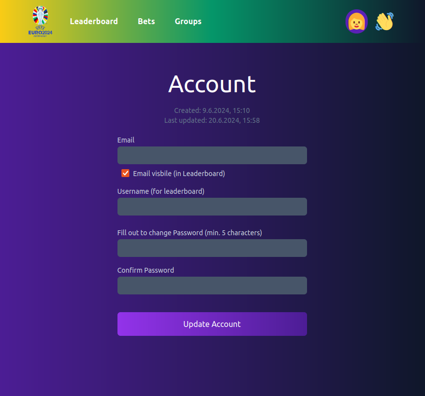

# README

## 1. Introduction
<!-- - **Project Name**
- **Description**: Briefly describe the project and its purpose. Mention that it was a fun project where friends could place football bets.
- **Motivation**: Explain why you created the project and what you aimed to achieve. -->

The project was created to provide a platform for friends/colleagues to place bets on EURO2024 football games and compete against each other. The motivation behind the project was to trial Pocketbase as a backend service, and to create a fun and interactive way to engage with the EURO2024 tournament.

## 2. Features
- **Bet Placement**
  - Games are displayed as cards, and are frozen 1hr before the game starts.
  - Users can place bets on the 90min outcome of the game.
  - An exact match gets 4 points, a correct goal difference gets 3 points, and guessing the winner is worth 2 points, otherwise 0 points.
- **Leaderboard**
  - A list of users ranked by their total points.
- **Ranking Chart**
  - A chart showing the ranking of users over time, as the tournament progresses.
- **User Account Management**
  - Users can create an account, login, and update their username and password.

## 3. Screenshots
**Account Page**



**Betting Page**


**Leaderboard**


**Chart**


**Groups**


**Pocketbase Backend**


## 4. Technical Details
- **Technologies Used**
  - Frontend: Astro, Tailwind CSS, HTMX
  - Backend: Pocketbase
  - Database: Pocketbase uses sqlite as the database
  - Hosting: DigitalOcean 4$ Droplet
- **Code Structure**
  - Frontend: The frontend is built using Astro, a static site generator. The site is built using components, and the data is fetched from the Pocketbase backend, using regular fetch requests in most cases, instead of using the client sdk.
  - There is an "aftersave" hook in ./pb/pb_hooks that recalculates the user points after a game result is saved.

## 5. Contributors
- **List of Contributors**:
  - Armin Emmert
  - Cornelius Rittner
  - Michael Stuber

## 6. Development and Deployment

### 6.1. Install npm packages and run the project

```sh
cd www
yarn install
yarn dev
```

### 6.2. Renew certs:

```sh
docker compose run --rm  certbot certonly --webroot --webroot-path /var/www/certbot/ --dry-run -d bets.emmert.hu
```